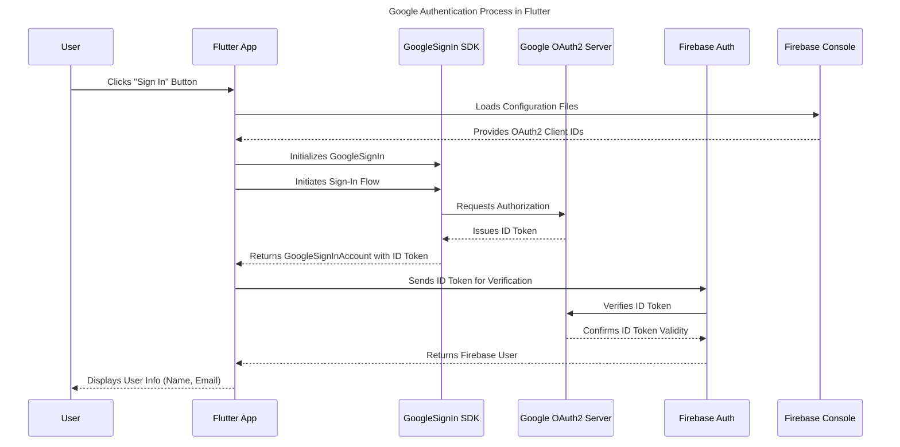

# google_signin

An app which authenticates the user through Google.

## Sequence Diagram

Sequence diagram of the authentication process using Google:

```mermaid
sequenceDiagram
    title Google Authentication Process in Flutter

    participant User
    participant FlutterApp as Flutter App
    participant GoogleSignInSDK as GoogleSignIn SDK
    participant GoogleOAuth2 as Google OAuth2 Server
    participant FirebaseAuth as Firebase Auth
    participant FirebaseConsole as Firebase Console

    User ->> FlutterApp: Clicks "Sign In" Button
    FlutterApp ->> FirebaseConsole: Loads Configuration Files
    FirebaseConsole -->> FlutterApp: Provides OAuth2 Client IDs
    
    FlutterApp ->> GoogleSignInSDK: Initializes GoogleSignIn
    
    FlutterApp ->> GoogleSignInSDK: Initiates Sign-In Flow
    
    GoogleSignInSDK ->> GoogleOAuth2: Requests Authorization
    GoogleOAuth2 -->> GoogleSignInSDK: Issues ID Token
    
    GoogleSignInSDK -->> FlutterApp: Returns GoogleSignInAccount with ID Token
    
    FlutterApp ->> FirebaseAuth: Sends ID Token for Verification
    FirebaseAuth ->> GoogleOAuth2: Verifies ID Token
    GoogleOAuth2 -->> FirebaseAuth: Confirms ID Token Validity
    
    FirebaseAuth -->> FlutterApp: Returns Firebase User
    FlutterApp -->> User: Displays User Info (Name, Email)
```
